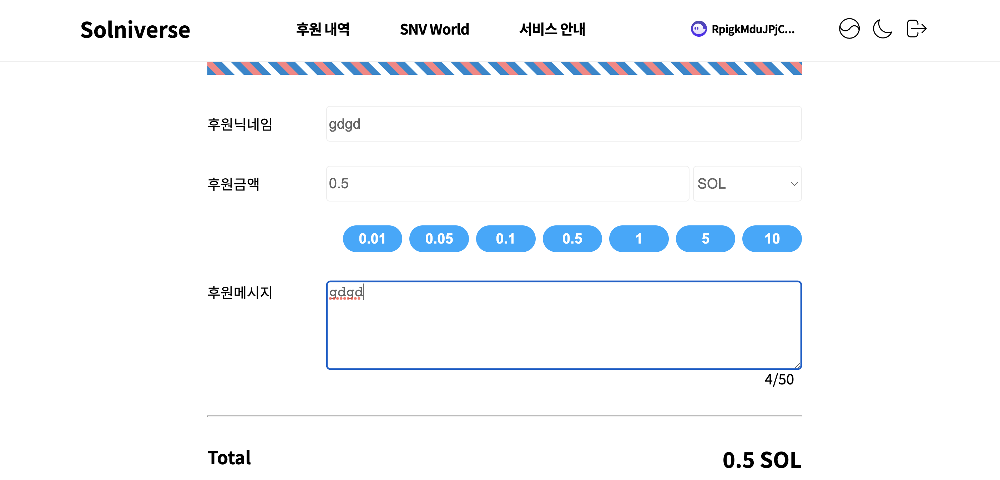
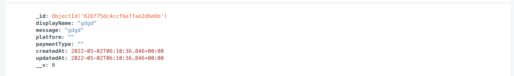
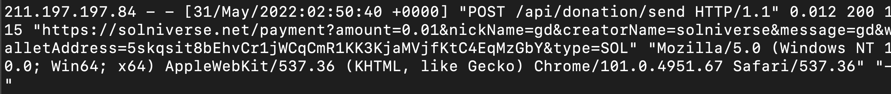
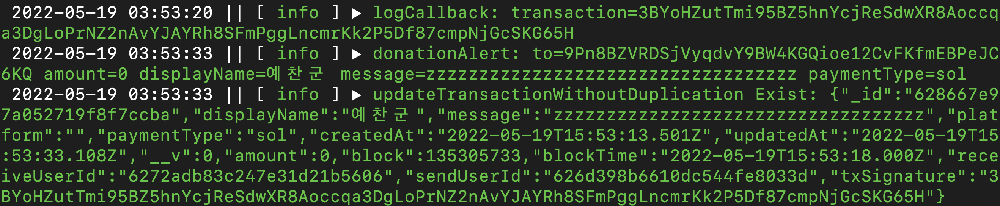
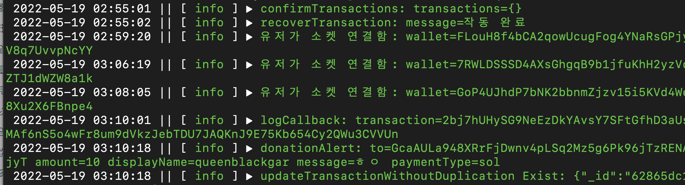

# 로그 시스템을 활용한 결제 에러 감지

[TOC]


## Summary

- 개요
  - Solniverse 서비스는 결제 완료 시점을 백엔드 서버에서 socket의 subscribe기능을 활용해 블록체인에서 확인함
  - 결제가 완료(finalized)되면 블록체인 네트워크에서 onLogs(소켓 subscribe) 기능을 통해 해당 블록 트랜잭션의 signature을 받은 후 트랜잭션 상세 정보를 받아 MongoDB에 해당 내용을 저장
  - 저장한 내용을 소켓 통신을 통해 클라이언트에게 반환해 tts프로그램을 통해 화면에 송출
- 저장하고 있는 로그의 종류
  1. access log(FE) :
     - nginx의 access log 중 서비스 접근 및 요청에 대한 로그 기록
  2. backend log(BE) : 
     * 블록체인 네트워크와 연결된 소켓 정보
     * 결제 성공시 DB에 저장되는 내용
     * 클라이언트에게 보내는 메세지
     * 도네이션 성공 후 지급되는 포인트 정보
     * 도네이션 순위 정보
  3. MongoDB(DB)
     - Monstache를 이용한 DB documents Realtime Sync
- 결제 오류 감지를 이용한 방법
  - 결제량 이동평균 대비 실 결제량 감지
  - 결제요청(FE) 대비 실 결제량(BE) 감지
  - 일정 주기로 DB를 탐색하며 update되지 않은 documents 감지


## Elastic Stack 개요

- Elacticsearch : DB, 검색 도구, 데이터 관리
- Logstash : 데이터 수집
- Kibana : 데이터 통계, 시각화
- Beats : 쉬운 데이터 수집 


<details open>
  <summary><h3>Elastic Stack 흔적</h3></summary>
  <a>링크</a>
</details>


## 솔니버스 결제 로직


1. 결제 정보를 입력하면 DB에 임시저장상태(message, displayName, platform만 저장)
   - platform은 oauth가 트위치 기반으로만 되어있기 때문에 아직까진 비활성화





### 	클라이언트가 요청한 결제 요청




2. 블록체인 네트워크에서 finalized된(블록에 무사히 올라간) 트랜잭션 Signature을 받아온 후 callback 메서드에 포함된 getTransaction을 통해 트랜잭션의 상세 정보를 받아와 DB에 저장

```javascript
const setLogs = () =>
  recoverTransaction().then(async () => {
		...
    onLogsFinalId = connection.onLogs(
      new web3.PublicKey(shopWalletaddress),
      finalizeCallback,
      "finalized",
    );
  });

setLogs();

```

### 실제 작동한 로그

- logCallback : getTransaction을 위한 트랜잭션 Signature 정보
- donationAlert : 클라이언트에게 전달할 도네이션 메세지 정보(tts에 이용될 수 있도록 전달)
- updateTransactionWithoutDuplication Exist : 도네이션 정보가 업데이트 될 때 이용할 정보
  - DB에 저장될 정보는 Exist, New가 있는데 Exist는 클라이언트가 새롭게 생성한 도네이션 메세지 정보가 있을 때(1번의 임시저장 상태) 도네이션이 성공하면 Exist로 해당 내용 업데이트
  - New는 이미 생성되어 있는 딥링크, qr코드(도네이션 메세지 정보)가 있다면 같은 내용을 이용하므로 해당 documentId를 제외하고 내용을 복사해 새로운 document 생성




3. 결제 오류 감지

   - 결제 요청 대비 실 결제량 :

     위에서 본 결제 요청(FE) 대비 실 결제량(BE)을 엘라스틱서치의 histogram으로 일정 주기마다 검색 후 일정치 이하로 내려가면 슬랙에 알림을 보낸다.

     - 고려한 점

       - 내가 원하는건 FE에서 온 결제 요청 로그 대비 DB에서 온 실 결제 로그의 결과를 보고싶은데 파일비트를 통해 저장될때는 서로 다른 인덱스로 저장된다. 두개의 서로 다른 인덱스를 결합해 원하는 결과를 도출할 수 있을까?

       ```java
       // 2개 인덱스 Request
       GET /mylog,backlog/_search
       {  
         "size": 0, 
         "query": {
           "bool": {
             // should의 가중치로 점수가 높은 결과를 우선적으로 검색
             "should": [
               {
                 "bool": {
                   // term, prefix로 mylog인덱스의 request.keyword : /api/donation/send 검색
                   "must": [
                     {
                       "prefix": {
                         "request.keyword": {
                           "value": "/api/donation/send"
                         }
                       }
                     },
                     {
                       "term": {
                         "_index": {
                           "value": "mylog"
                         }
                       }
                     }
                   ]
                 }
               },
               {
                 "bool": {
                   // term, prefix로 backlog verb.keyword :
                   // updateTransactionWithoutDuplication Exist 검색
                   "must": [
                     {
                       "prefix": {
                         "verb": {
                           "value": "updateTransactionWithoutDuplication"
                         }
                       }
                     },
                     {
                       "term": {
                         "_index": {
                           "value": "backlog"
                         }
                       }
                     }
                   ]
                 }
               }
             ]
           }
         },
         "aggs": {
           "range": {
             // date_range aggregation으로 검색할 범위 조정
             "date_range": {
               "field": "time",
               "ranges": [
                 {
                   "from": "now-1h",
                   "to": "now"
                 }
               ], "keyed": false
             },
             "aggs": {
               // date_range로 집계된 bucket을 histogram으로 10분 인터벌로 집계
               "histogram": {
                 "date_histogram": {
                   "field": "time",
                   "fixed_interval": "10m",
                   "order": {
                     "_key": "asc"
                   },
                   "keyed": false,
                   "min_doc_count": 0,
                   "extended_bounds": {
                     "max": "now"
                   }
                 },
                 "aggs": {
                   // histogram으로 집계된 bucket 중 FE의 결제 요청 수
                   "request_api/donation/send": {
                     "filter": {
                       "term": {
                         "request.keyword": "/api/donation/send"
                       }
                     }
                   },
                   // histogram으로 집계된 bucket 중 BE의 실제 결제 수
                   "DBupdateTransaction": {
                     "filter": {
                       "term": {
                         "verb": "updateTransactionWithoutDuplication"
                       }
                     }
                   }
                 }
               }
             }
           }
         }
       }
       ```

     - 결과

       - 프로젝트 발표 전날인 22/05/19 정오경에 결제 요청을 보냈는데 응답이 오지 않는 오류를 발견하고 결제 로직에 문제가 있음을 의심

       

       

       - 실제로 인덱스를 집계해보아도 결제 요청은 7건이 온것에 비해 DB에 업데이트 된 결과가 0건이고 10분후도 마찬가지

       

       

       - 이때 backlog를 봐도 정시 경(UTC + 09:00 기준 03:00)updateTransaction 로그가 날아오지 않는다.

       

       

       - 이후 슬랙을 통해 문제를 받아 볼 수 있도록 OpenDistro를 통해 알림기능 추가

       

       

     - 해결

       - 백엔드 팀원과 논의해 solana web3.js의 onLogs에 문제가 있을 수 있음을 고려하고 socket 연결로 바꿈

         ```javascript
         async wsReconnect() {
           // 소켓의 close를 감지해서 해당 subscribe를 끊고
           solanaCluster.connection._rpcWebsocket.on('close', async () => {
             ...
             try {
               if (solanaCluster.connection._logSubscribtions[this.logsId]) {
                 await solanaCluster.offLogs(this.logId);
               } catch (err) {
                 log.error(`log websocket disconnection fail, error ${err.stack}`)
               }
               // 다시 연결
               this.lastSignatureAfter();
             }
           })
         }
         ```

         

     - 1시간마다 connection을 다시 새로 set해 transaction 복구 메서드를 이용해 업데이트 되지 않은 DB document를 복구(임시)

     
